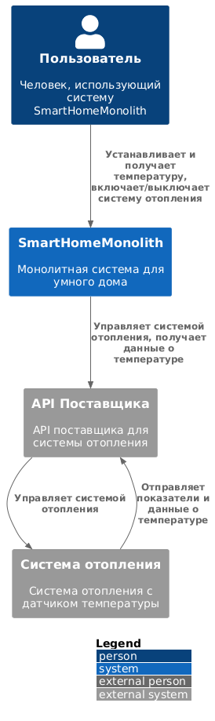

# Спринт 3
## Анализ и план работ

### Возможности исходного монолитного приложения

API предоставляет следующие функции:
 - дистанционное управление отоплением (включение/выключение),
 - установка требуемой температуры,
 - просмотр текущей температуры,
 - автоматическое поддержание температуры (функция в разработке, см. комментарий разработчика: // TODO: Реализовать логику автоматического поддержания температуры в слое сервиса).

### Структура исходного монолита

 - Язык: Java
 - Хранилище данных: PostgreSQL
 - Архитектура: монолитная
 - Работа с пользователем: HTTP-запросы, синхронная обработка
 - Взаимодействие с VendorAPI: документация отсутствует
 - Масштабируемость: вертикальная
 - Деплой: виртуальная машина, необходимо остановить для обслуживания.

### Домены и контексты

 - Домен: Управление устройствами
   - Контекст: Контроль за отоплением — включение и выключение системы
   - Контекст: Настройка температуры — установка требуемого значения
 - Домен: Температурный мониторинг
   - Контекст: Обработка данных с датчиков температуры — отображение текущей температуры

### Проблемные аспекты монолита
 - Ограниченные функции (нет возможности добавления новых устройств через API, отсутствует автоматическое поддержание температуры)
 - Низкие показатели масштабируемости, отказоустойчивости и скорости разработки
 - Зависимость от VendorAPI из-за отсутствия собственного производства оборудования

### Контекстная диаграмма

Схема [текущего монолита](./diagrams/monolith/context.puml)

Отрендеренная схема 


## Проектирование новой архитектуры на микросервисах

### Декомпозиция на микросервисы

 - Управление устройствами
 - Управление пользователями и их домами
 - Взаимодействие с внешними API
 - Мониторинг состояния устройств

### Диаграмма контейнеров
Схема [диаграмма контейнеров](./diagrams/containers/SmartHomeSystem.puml)

Отрендеренная схема 

### Диаграмма компонентов

#### Компонент для управления устройствами

Схема [диаграмма компонентов](./diagrams/components/device-management/SmartHomeSystem.puml)

Отрендеренная схема 

#### Компонент для обработки телеметрии

Схема [диаграмма компонентов](./diagrams/components/telemetry-management/SmartHomeSystem.puml)

Отрендеренная схема 

### Диаграмма структуры кода

Схема [диаграмма структуры кода](./diagrams/code/SmartHomeSystem.puml)

Отрендеренная схема 

### ER-диаграмма данных

Схема [ER-диаграммы](./diagrams/er/SmartHomeSystem.puml)

Отрендеренная схема 


# Создание и документирование API

## API для микросервисов системы управления устройствами и телеметрией

### 1. Типы API

В зависимости от типа взаимодействия между микросервисами выбраны следующие подходы:

- **REST API**:
  - Используется для синхронных операций с CRUD-сущностями, такими как `User`, `House`, `Device`, `DeviceType`, и `Module`.
  - Применяется для управления состоянием устройств.

- **AsyncAPI**:
  - Используется для асинхронной передачи данных телеметрии и уведомлений через брокер сообщений, например, Kafka.
  - Передача телеметрии устройства происходит по событию.

 
### 2. Сервис «Управление устройствами» (Device Service)

### Эндпойнты

1. `GET /devices/{device_id}` – получение информации об устройстве.
2. `PUT /devices/{device_id}/status` – обновление состояния устройства.
3. `POST /devices/{device_id}/command` – отправка команды устройству.

### Структура API [OpenApi схема](./schemas/rest_api/swagger.yaml)

```yaml
openapi: 3.0.0
info:
  title: Device Service
  version: 0.1.0

paths:
  /devices/{device_id}:
    get:
      summary: Получение информации об устройстве
      parameters:
        - name: device_id
          in: path
          required: true
          schema:
            type: string
            format: uuid
      responses:
        '200':
          description: Устройство найдено
          content:
            application/json:
              schema:
                $ref: '#/components/schemas/Device'
              examples:
                example-1:
                  summary: Успешный ответ
                  value:
                    id: "123e4567-e89b-12d3-a456-426614174000"
                    serial_number: "SN123456789"
                    status: true
                    type_id: "type-uuid"
                    house_id: "house-uuid"
        '404':
          description: Устройство не найдено
          content:
            application/json:
              examples:
                example-1:
                  summary: Устройство не найдено
                  value:
                    error: "Device not found."
    put:
      summary: Обновление состояния устройства
      parameters:
        - name: device_id
          in: path
          required: true
          schema:
            type: string
            format: uuid
      requestBody:
        required: true
        content:
          application/json:
            schema:
              type: object
              properties:
                status:
                  type: boolean
      responses:
        '200':
          description: Состояние обновлено успешно
          content:
            application/json:
              examples:
                example-1:
                  summary: Ответ об успешном обновлении
                  value:
                    message: "Device status updated successfully."
        '404':
          description: Устройство не найдено
          content:
            application/json:
              examples:
                example-1:
                  summary: Устройство не найдено
                  value:
                    error: "Device not found."
        '500':
          description: Ошибка сервера
          content:
            application/json:
              examples:
                example-1:
                  summary: Ошибка сервера
                  value:
                    error: "Internal server error."
    post:
      summary: Отправка команды устройству
      parameters:
        - name: device_id
          in: path
          required: true
          schema:
            type: string
            format: uuid
      requestBody:
        required: true
        content:
          application/json:
            schema:
              type: object
              properties:
                command:
                  type: string
                  description: Команда для выполнения устройством
      responses:
        '200':
          description: Команда отправлена успешно
          content:
            application/json:
              examples:
                example-1:
                  summary: Ответ об успешной отправке команды
                  value:
                    message: "Command sent successfully."
        '404':
          description: Устройство не найдено
          content:
            application/json:
              examples:
                example-1:
                  summary: Устройство не найдено
                  value:
                    error: "Device not found."
        '500':
          description: Ошибка сервера
          content:
            application/json:
              examples:
                example-1:
                  summary: Ошибка сервера
                  value:
                    error: "Internal server error."

components:
  schemas:
    Device:
      type: object
      properties:
        id:
          type: string
          format: uuid
        serial_number:
          type: string
        status:
          type: boolean
        type_id:
          type: string
          format: uuid
        house_id:
          type: string
          format: uuid
```

### Примеры запросов и ответов

#### Запрос на получение информации об устройстве

**Запрос:**

```http request
GET /devices/123e4567-e89b-12d3-a456-426614174000
```
**Ответ:**
```json
{
  "id": "123e4567-e89b-12d3-a456-426614174000",
  "serial_number": "SN123456789",
  "status": true,
  "type_id": "type-uuid",
  "house_id": "house-uuid"
}
```

#### Запрос на обновление состояния устройства

**Запрос:**

```http request
PUT /devices/123e4567-e89b-12d3-a456-426614174000/status
Content-Type: application/json

{
  "status": false
}
```
**Ответ:**
```json
{
  "message": "Device status updated successfully."
}
```

#### Запрос на отправку команды устройству

**Запрос:**

```http request
POST /devices/123e4567-e89b-12d3-a456-426614174000/command
Content-Type: application/json

{
  "command": "reboot"
}
```
**Ответ:**
```json
{
  "message": "Command sent successfully."
}
```

#### Коды ответа

- **200** — успешный запрос.
- **404** — устройство не найдено.
- **500** — ошибка сервера.

## Сервис «Обработка телеметрии» (Telemetry Service)

### AsyncAPI для Kafka [AsyncAPI схема](./schemas/async_api/swagger.yaml)

**Событие:** `telemetry.data.new` – отправка новых данных телеметрии в систему.

```yaml
asyncapi: 3.0.0
info:
  title: Telemetry Service
  version: 1.0.0
  description: 'Сервис обработки телеметрии, получает данные от устройств'
channels:
  telemetry.data.new:
    address: telemetry.data.new
    messages:
      subscribe.message:
        contentType: application/json
        payload:
          type: object
          properties:
            device_id:
              type: string
              format: uuid
            telemetry_type:
              type: string
              description: 'Тип телеметрии (например, температура)'
            timestamp:
              type: string
              format: date-time
            data:
              type: object
              additionalProperties: true
    description: Новые телеметрические данные
operations:
  telemetry.data.new.subscribe:
    action: send
    channel:
      $ref: '#/channels/telemetry.data.new'
    summary: Получить новые телеметрические данные
    messages:
      - $ref: '#/channels/telemetry.data.new/messages/subscribe.message'
```

### Примеры сообщений

#### Сообщение телеметрии

**Событие:** `telemetry.data.new`

**Сообщение:**

```json
{
  "device_id": "123e4567-e89b-12d3-a456-426614174000",
  "telemetry_type": "temperature",
  "timestamp": "2024-11-04T15:04:05Z",
  "data": {
    "value": 25.6
  }
}
```

### Коды ответа

- **200** — Сообщение успешно принято и обработано.
- **400** — Некорректные данные телеметрии.
- **500** — Ошибка сервера при обработке данных.
