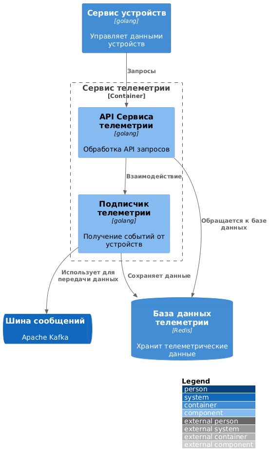

# Спринт 3
## Анализ и план работ

### Возможности исходного монолитного приложения

API предоставляет следующие функции:
 - дистанционное управление отоплением (включение/выключение),
 - установка требуемой температуры,
 - просмотр текущей температуры,
 - автоматическое поддержание температуры (функция в разработке, см. комментарий разработчика: // TODO: Реализовать логику автоматического поддержания температуры в слое сервиса).

### Структура исходного монолита

 - Язык: Java
 - Хранилище данных: PostgreSQL
 - Архитектура: монолитная
 - Работа с пользователем: HTTP-запросы, синхронная обработка
 - Взаимодействие с VendorAPI: документация отсутствует
 - Масштабируемость: вертикальная
 - Деплой: виртуальная машина, необходимо остановить для обслуживания.

### Домены и контексты

 - Домен: Управление устройствами
   - Контекст: Контроль за отоплением — включение и выключение системы
   - Контекст: Настройка температуры — установка требуемого значения
 - Домен: Температурный мониторинг
   - Контекст: Обработка данных с датчиков температуры — отображение текущей температуры

### Проблемные аспекты монолита
 - Ограниченные функции (нет возможности добавления новых устройств через API, отсутствует автоматическое поддержание температуры)
 - Низкие показатели масштабируемости, отказоустойчивости и скорости разработки
 - Зависимость от VendorAPI из-за отсутствия собственного производства оборудования

### Контекстная диаграмма

Схема [текущего монолита](./diagrams/monolith/context.puml)

Отрендеренная схема 

## Проектирование новой архитектуры на микросервисах

### Декомпозиция на микросервисы

 - Управление устройствами
 - Управление пользователями и их домами
 - Взаимодействие с внешними API
 - Мониторинг состояния устройств

### Диаграмма контейнеров
Схема [диаграмма контейнеров](./diagrams/containers/SmartHomeSystem.puml)

Отрендеренная схема 

### Диаграмма компонентов

#### Компонент для управления устройствами

Схема [диаграмма компонентов](./diagrams/components/device-management/SmartHomeSystem.puml)

Отрендеренная схема 

#### Компонент для обработки телеметрии

Схема [диаграмма компонентов](./diagrams/components/telemetry-management/SmartHomeSystem.puml)

Отрендеренная схема 

### Диаграмма структуры кода

Схема [диаграмма структуры кода](./diagrams/code/SmartHomeSystem.puml)

Отрендеренная схема 

### ER-диаграмма данных

Схема [ER-диаграммы](./diagrams/er/SmartHomeSystem.puml)

Отрендеренная схема 
